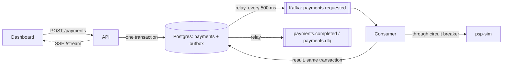
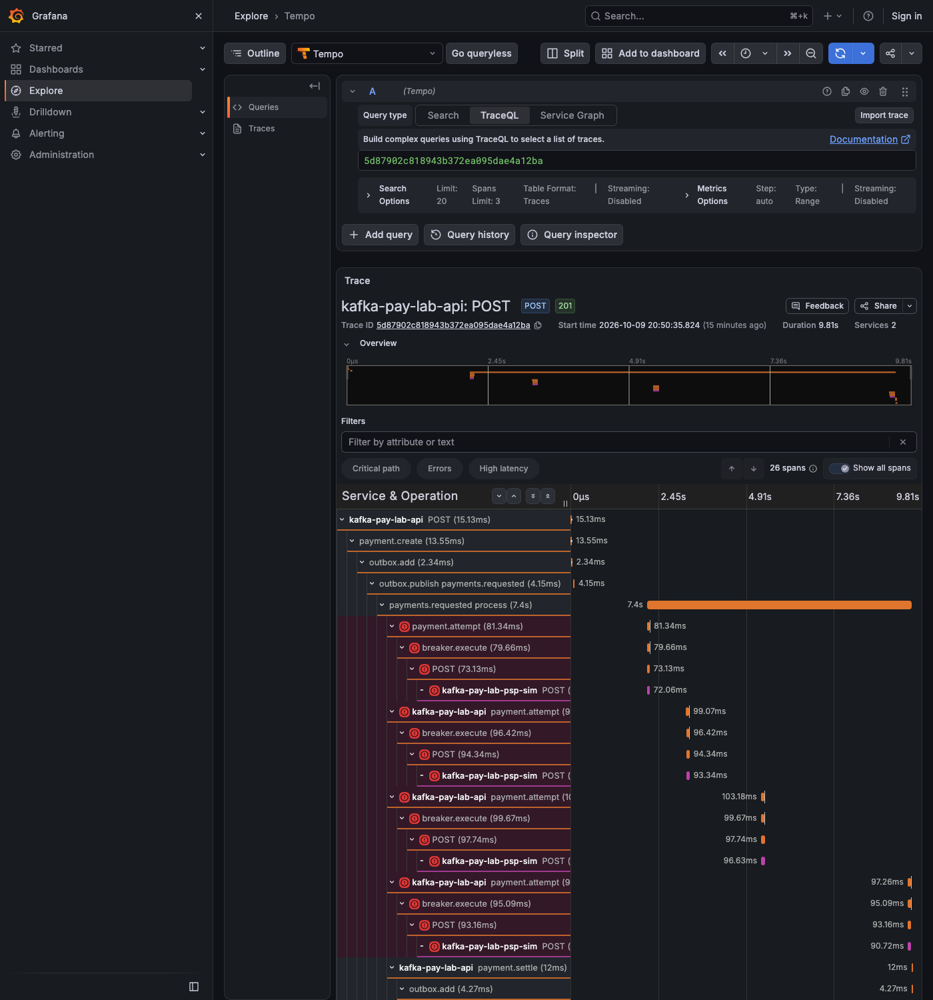

# kafka-pay-lab

[](https://github.com/sotream/kafka-pay-lab/actions/workflows/ci.yml)

A local lab for **watching Kafka work**. A small payments service sends payments through Kafka to a
simulated payment provider that you can make slow, make refuse payments, or knock over completely. You
see the effects live: consumer lag grows and drains, a circuit breaker opens and recovers, failed
payments land in a dead-letter topic, and events pile up in an outbox when Kafka itself is down.

It is a learning stand, not production code. Built on [nest-next-starter](docs/starter.md)
(NestJS + Next.js + Postgres + Redis + Kafka).

## What is in it

| App            | Port | What it is                                                                                         |
| -------------- | ---- | -------------------------------------------------------------------------------------------------- |
| `apps/web`     | 3000 | **Dashboard**: breaker state, consumer lag, outbox backlog, live payments, load generator          |
| `apps/api`     | 4000 | **Payments service**: HTTP API, transactional outbox, Kafka producer and consumer, circuit breaker |
| `apps/psp-sim` | 4100 | **Provider simulator** with its own control page: latency, outages, random failures, declines      |
| Kafka UI       | 8080 | Inspect topics, partitions, messages and the consumer group                                        |

## How it works



1. `POST /payments` saves the payment (`PENDING`) **and** an outbox row in one database transaction.
2. A relay publishes outbox rows to Kafka (`payments.requested`). If Kafka is down they simply wait.
3. The consumer reads one message at a time per partition and calls the provider through a **circuit breaker**.
4. Outcomes: approved -> `COMPLETED`; refused (card declined etc.) -> `DECLINED`, final, no retry;
   provider unreachable -> up to 4 tries with backoff 1 s, 2 s, 4 s, then `FAILED` and a copy in `payments.dlq`.
5. When the breaker **opens**, the consumer **holds** the current message and stops reading: everything behind it stays in Kafka, so **consumer lag grows**.
   After 10 s the breaker lets one trial payment through (`HALF_OPEN`); success closes it and the lag drains.

## Quick start

Needs Node 24, pnpm and Docker.

```bash
cp .env.example .env          # KAFKA_ENABLED=true is already set for the lab
pnpm install
pnpm infra:up                 # Postgres, Redis, Kafka, Kafka UI
pnpm db:migrate
pnpm db:seed                   # demo users for signing in to the dashboard
pnpm dev                      # api + web + psp-sim
```

Open the dashboard at <http://localhost:3000> and sign in with a user from `pnpm db:seed` (it is the
default page after sign-in). The simulator is at <http://localhost:4100>, Kafka UI at
<http://localhost:8080>. Both pages explain themselves: hover any label or `?` for help.

If a default port is taken on your machine (for example another Kafka on 9092), change `KAFKA_PORT`,
`REDIS_PORT`, `KAFKA_UI_PORT` in `.env` and keep `KAFKA_BROKERS`, `REDIS_URL` and
`NEXT_PUBLIC_KAFKA_UI_URL` in step with them.

## Scenarios you can try

Open the dashboard and the simulator side by side. "Generate" is the dashboard button.

| #   | Scenario                         | In the simulator                                               | On the dashboard                                                                                                                               | What happens in Kafka                                                                                                                  |
| --- | -------------------------------- | -------------------------------------------------------------- | ---------------------------------------------------------------------------------------------------------------------------------------------- | -------------------------------------------------------------------------------------------------------------------------------------- |
| 1   | Normal flow                      | preset **Healthy**, Generate 20                                | payments go `PENDING` -> `COMPLETED` quickly; lag stays ~0                                                                                     | one message per payment on `payments.requested`, a result on `payments.completed`                                                      |
| 2   | Slow provider, **consumer lag**  | preset **Slow** (2 s per call), Generate 100 with 0 ms delay   | breaker stays `CLOSED`; lag climbs, then drains slowly                                                                                         | producer is faster than the consumer, so the backlog sits in the topic                                                                 |
| 3   | Declined payments                | preset **Broke customer**, or amounts ending 51-54             | `DECLINED` with a reason; breaker unaffected                                                                                                   | no retries: a refusal is a final answer                                                                                                |
| 4   | Provider down, **breaker opens** | preset **Outage**, Generate 20                                 | the first payment burns 4 tries and becomes `FAILED`; the 5th failure in a row opens the breaker (`OPEN`); the rest stay `PENDING`; lag climbs | consumer holds the current message, offsets are not committed                                                                          |
| 5   | **Recovery**                     | switch back to **Healthy**                                     | breaker `HALF_OPEN` for one trial, then `CLOSED`; lag drains to 0                                                                              | consumer carries on and reprocesses the waiting messages                                                                               |
| 6   | Provider hangs                   | Outage = **Hang**                                              | calls time out after 3 s, breaker opens                                                                                                        | same as 4, but slower: each failure costs a full timeout                                                                               |
| 7   | Connection cut                   | Outage = **Connection reset**                                  | like 4                                                                                                                                         | same as 4                                                                                                                              |
| 8   | Flaky provider                   | preset **Flaky** (30% 503)                                     | retries usually succeed; breaker may flicker                                                                                                   | some messages need a retry, none are lost                                                                                              |
| 9   | **Dead-letter topic**            | preset **Outage**, Generate just 1 payment                     | after ~7 s of retries (1 s, 2 s, 4 s) the payment is `FAILED`; 4 failures are fewer than the breaker's 5, so it stays `CLOSED`                 | a copy lands in `payments.dlq` (see Kafka UI)                                                                                          |
| 10  | Duplicate protection             | any                                                            | no double charges                                                                                                                              | provider returns the stored result for a repeated `Idempotency-Key`; the consumer skips settled payments                               |
| 11  | **Kafka down, outbox backlog**   | `docker compose stop kafka`                                    | "Outbox backlog" grows; payments stay `PENDING`; creating payments still works                                                                 | nothing is lost: `docker compose start kafka`, the backlog drains at once and payments complete once the consumer has rejoined (~20 s) |
| 12  | Force one outcome                | Generate with amount `1051`, `1091`, `1092`, ... (table below) | that exact outcome per payment                                                                                                                 | see below                                                                                                                              |

## Observability

Opt-in and off by default. With three flags in `.env` and one command, one payment shows up in Grafana as
a single trace (HTTP, outbox, Kafka, consumer, circuit breaker, provider), with its logs, metrics and
alerts linked.



```bash
# .env: OTEL_ENABLED=true  METRICS_ENABLED=true  LOG_DIR=../../.data/logs
pnpm obs:up            # Collector, Tempo, Prometheus, Loki, Alloy, Grafana on 127.0.0.1
pnpm dev
pnpm obs:scenario      # slow, failing and breaker-open traffic so the dashboards fill and alerts fire
```

Grafana is at <http://127.0.0.1:3001>. Step by step:
[observability walkthrough](docs/guides/observability-walkthrough.md).

## Provider simulator

Settings change at runtime on <http://localhost:4100> (or `PUT /sim/state`).

| Setting               | Effect                                                                                              |
| --------------------- | --------------------------------------------------------------------------------------------------- |
| Latency + jitter      | how long each answer takes; above the API timeout (`PSP_TIMEOUT_MS`, 3 s) it counts as a failure    |
| Outage                | `HTTP 503`, `Hang` (never answers) or `Connection reset` for every request                          |
| Random 503 rate       | share of requests that randomly fail                                                                |
| Decline rate + reason | share of requests refused: `insufficient_funds`, `card_declined`, `card_expired`, `fraud_suspected` |

**Magic amounts** force one outcome for one payment. Amounts are in cents; the last two digits decide:

| Ends in                   | Result                                                                        |
| ------------------------- | ----------------------------------------------------------------------------- |
| `51` / `52` / `53` / `54` | declined: insufficient funds / card declined / card expired / fraud suspected |
| `91`                      | HTTP 503                                                                      |
| `92`                      | never answers (hang)                                                          |
| `93`                      | approved after 5 extra seconds                                                |
| `94`                      | connection reset                                                              |

Precedence: magic amount, then outage, then random 503 rate, then decline rate. Latency always applies.

## Topics and statuses

| Topic (3 partitions) | Content                                        |
| -------------------- | ---------------------------------------------- |
| `payments.requested` | one message per new payment (key = payment id) |
| `payments.completed` | final result of every settled payment          |
| `payments.dlq`       | payments that failed after all retries         |

Consumer group: `kafka-pay-lab-payments`.

| Status      | Meaning                                                           |
| ----------- | ----------------------------------------------------------------- |
| `PENDING`   | saved, waiting for the consumer                                   |
| `COMPLETED` | provider approved                                                 |
| `DECLINED`  | provider refused for a business reason (final)                    |
| `FAILED`    | provider unavailable through all retries (also in `payments.dlq`) |

## Configuration

All in `.env` (see `.env.example`): `KAFKA_ENABLED`, `PSP_URL`, `PSP_TIMEOUT_MS`, `CB_FAILURE_THRESHOLD`,
`CB_RESET_TIMEOUT_MS`, `PAYMENT_MAX_ATTEMPTS`, `PAYMENT_RETRY_BASE_MS`, `OUTBOX_POLL_MS`, `LAG_POLL_MS`.
Published outbox rows are deleted after `OUTBOX_RETENTION_DAYS` (default 14, 0 = keep forever) by a job on
`OUTBOX_CLEANUP_CRON` (default `0 4 * * *`); unpublished rows are never deleted ([ADR 0014](docs/adr/0014-outbox-retention.md)).
Observability: `OTEL_ENABLED`, `OTEL_EXPORTER_OTLP_ENDPOINT`, `METRICS_ENABLED`, `METRICS_HOST`, `METRICS_PORT`,
`LOG_DIR`, `LOG_ROLL_SIZE`, `GRAFANA_PORT`, `GRAFANA_ADMIN_PASSWORD`.
To speed up experiments try `CB_RESET_TIMEOUT_MS=3000`. The simulator port is `PSP_SIM_PORT` (default 4100).

While the breaker is open the API log shows `Circuit open: holding the current message` once per probe
cycle; the consumer keeps its group membership with heartbeats and never crashes.

## Repo layout

```
apps/api/src/modules/payments/       payments module: controller, outbox use, consumer, breaker, stream
apps/api/src/infrastructure/outbox/  transactional outbox (entity, service, relay)
apps/psp-sim/                        provider simulator (API + public/index.html control page)
apps/web/src/                        dashboard
observability/                       Collector, Tempo, Prometheus, Loki, Alloy and Grafana config (as code)
scripts/                             obs-scenario.mjs (traffic), check-provisioning.mjs (CI check)
docs/superpowers/                    design spec and implementation plan
docs/starter.md                      the original starter README
```

The starter's `vehicles`, `auth` and `users` modules are kept untouched.

## Commands

```bash
pnpm lint | typecheck | test | build
pnpm test:e2e         # needs pnpm infra:up; the payments flow test also needs Kafka
pnpm obs:up | obs:down | obs:scenario | check:obs
```

## Known limits

Lab-grade on purpose: the dashboard needs a sign-in but the payments and stream API endpoints are public (no login), there
is one consumer instance, and retry counts restart if the API restarts mid-message.
