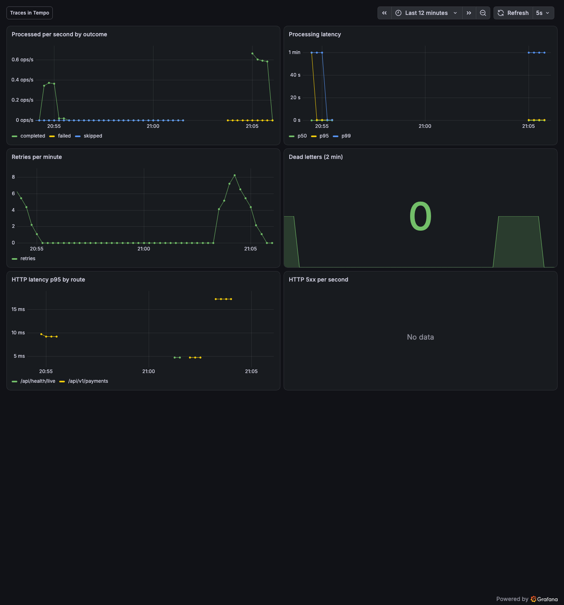

# Observability walkthrough

Follow one payment across HTTP, the outbox, Kafka, the consumer, the circuit breaker and the provider
simulator as a single trace, then jump from the trace to its logs and metrics, and watch an alert fire.
Everything is opt-in and off by default ([ADR 0010](../adr/0010-opentelemetry-opt-in.md),
[ADR 0012](../adr/0012-grafana-stack.md)).




## 1. Start

In your local `.env` (never committed) switch on the three flags:

```
OTEL_ENABLED=true
METRICS_ENABLED=true
LOG_DIR=../../.data/logs
```

Then, with Docker running:

```bash
pnpm infra:up && pnpm db:migrate
pnpm obs:up          # Collector, Tempo, Prometheus, Loki, Alloy, Grafana (profile "observability")
pnpm dev
```

- Grafana: <http://127.0.0.1:3001> (no sign-in; the admin password is `GRAFANA_ADMIN_PASSWORD`, default `admin`)
- Prometheus: <http://127.0.0.1:9090>, Tempo API: <http://127.0.0.1:3200>, Loki API: <http://127.0.0.1:3100>
- Metrics of the API: <http://127.0.0.1:9464/metrics> (its own listener, not on the API port)

All of these ports bind to `127.0.0.1` only. Stop the stack with `pnpm obs:down`.

On Linux the Prometheus container usually cannot reach a loopback-only listener on the host. Set
`METRICS_HOST` to the Docker bridge gateway address (usually `172.17.0.1`, see `docker network inspect
bridge`), not `0.0.0.0`: `/metrics` has no authentication and every scrape queries Postgres and Kafka,
so it must not be reachable from the LAN. On Docker Desktop for macOS the default works.

## 2. Trigger a failure

```bash
pnpm obs:scenario
```

It drives the provider simulator through five phases and creates payments in each: healthy traffic, a slow
provider, an outage (one payment burns four tries and lands in the dead-letter topic), a longer outage
(the breaker opens and payments wait), and recovery. It takes about three minutes and puts the simulator
back to healthy when it ends or when you press Ctrl+C. You can also use the simulator page at
<http://localhost:4100> by hand.

## 3. Find the trace

Grafana, Explore, data source Tempo. Run this TraceQL query and open a trace:

```
{ resource.service.name = "kafka-pay-lab-api" && span.payment.attempt = 4 }
```

That finds payments that used all four tries. The waterfall shows:

```
POST  (url.path=/api/v1/payments)              api (http server)
  payment.create            payment.id
    outbox.add                                  traceparent saved on the row
      outbox.publish payments.requested         relay, seconds later, same trace
        payments.requested process              consumer, parent from the Kafka header
          payment.attempt   payment.attempt=1..4
            breaker.execute breaker.state, breaker.outcome
              POST (fetch)                      api to the simulator
                POST /charges   psp.outcome     psp-sim (http server)
          payment.settle
            outbox.publish payments.completed / payments.dlq
```

Failed spans are red and carry the recorded exception. A payment held behind an open breaker shows one
long consumer span with a `breaker.hold` event.

## 4. Trace to logs to metrics

- On a span, "Logs for this span" opens Loki filtered by the trace id. Log lines are JSON with
  `trace_id` and `span_id`.
- In Explore with Loki, `{service="kafka-pay-lab-api"} |= "trace_id"`; each line has an "Open trace"
  link back to Tempo.
- The data source also links to metrics. Dashboards (folder `kafka-pay-lab`): Payments pipeline,
  Outbox and Kafka health, Circuit breaker. Each has a link to the traces.

## 5. See an alert fire

Grafana, Alerting, Alert rules, folder `kafka-pay-lab`:

- "Dead-letter topic is growing" and "Circuit breaker has been open too long" fire during `pnpm obs:scenario`.
- "Outbox oldest pending row is too old": run `docker compose stop kafka`, create two payments, wait about
  a minute, then `docker compose start kafka` and watch the backlog drain. Creating payments keeps working
  while Kafka is down; the backlog and its age grow.

The rules have no notification channel; they only show state.

## 6. Check the data without Grafana

```bash
curl -s 'http://127.0.0.1:3200/api/search?tags=service.name%3Dkafka-pay-lab-psp-sim&limit=5'
curl -sG http://127.0.0.1:9090/api/v1/query --data-urlencode 'query=payments_breaker_state'
curl -sG http://127.0.0.1:3100/loki/api/v1/query_range --data-urlencode 'query={service="kafka-pay-lab-api"} |= "trace_id"'
```

## Troubleshooting

- Prometheus target down: check `METRICS_ENABLED=true` and, on Linux, `METRICS_HOST`.
- No traces: check `OTEL_ENABLED=true` and that port `4318` answers on `127.0.0.1`. A stopped Collector
  never slows or fails payments; spans are just dropped.
- No logs: check `LOG_DIR` and that `.data/logs/api.log` appears (`pnpm obs:up` creates the folder).
- Turn it all off by removing the three flags. `pnpm infra:up` never starts this stack.

## What is not included

Sampling, retention, authentication and TLS, high availability, alert routing, exemplars and browser
tracing are left out on purpose; [ADR 0012](../adr/0012-grafana-stack.md) says what production needs.
